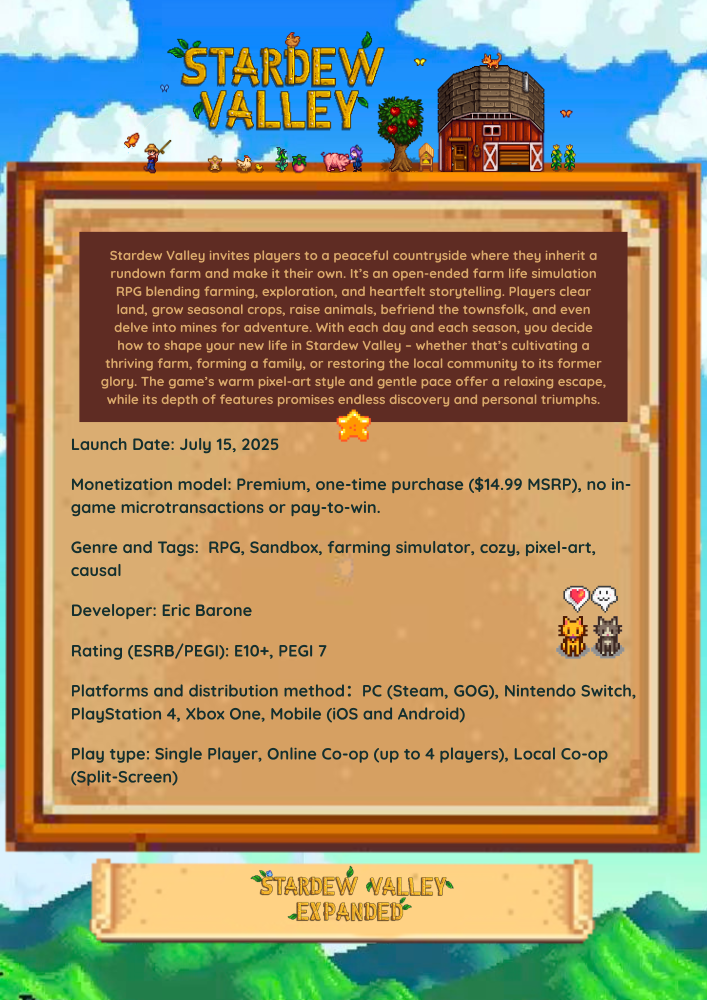
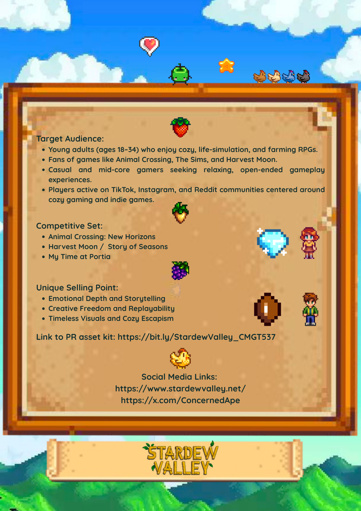

# Xinyue (Michelle) Zhang – Data & AI Project Hub

Welcome! I'm a graduate student in Communication Data Science at USC, focused on data analysis, AI applications, and data-driven product insights in consumer technology and gaming.

---

## Featured Projects

### 🎮 Sentiment Analysis on Game Communities
Analyzed how pre-launch and post-launch Reddit sentiment, emotion, and discussion volume related to game launch performance (peak CCU), with genre-level comparisons across Shooting and Simulation titles.

**Tech:** Python, Sentiment Analysis, Data Visualization, Regression Analysis

- 🔗 GitHub: [link](https://github.com/o1s31/game-sentiment-analysis/tree/main)
- 📊 Slides: [View Slides](https://www.canva.com/design/DAG5-dTQ1TM/0fQ0B7ZE8dKS4igqXXL40w/edit)

---

### 🌾 Stardew Valley GTM Strategy

Developed a go-to-market strategy for a simulation game, including audience segmentation, positioning, and launch planning.

Analyzed player motivations and comparable titles to define target segments and recommend a differentiated market entry strategy.

Proposed launch sequencing and growth approach based on user behavior assumptions and market positioning.

#### 📌 Product Fact Sheet

A summary of positioning, target audience, and core value proposition.

  
  

**Tech:** Market Analysis, User Segmentation, Product Strategy, GTM Strategy

- 📊 Slides: [View Slides](https://www.canva.com/design/DAGkk9sFGjc/RRPXIJRucGYv45BufAJDeg/edit?utm_content=DAGkk9sFGjc&utm_campaign=designshare&utm_medium=link2&utm_source=sharebutton)

---

### 📚 Duolingo Learning Model Analysis
Explored learning behavior and recall probability using large-scale Duolingo data, applying statistical modeling and regression techniques.

**Tech:** Python, pandas, Statistical Modeling, Regression Analysis, Data Visualization

- 🔗 GitHub: [link](https://github.com/o1s31/duolingo-learning-model)

---

### 🤖 AI Fit (Digital Twin Prototype)
Built a prototype that simulates virtual try-on using structured user body data (height, weight) to improve fit recommendations and reduce return risk.

Designed prompt-based workflows to generate consistent digital body representations and explored how AI-driven visualization influences user decision-making.

**Tech:** Generative AI, Prompt Engineering, AI Workflow Design, Product Prototyping

- 🔗 Demo: [link](https://v0.app/chat/clothing-shopping-experience-2yJDDrtnQ5s)

---

### 📊 Steam Pricing & Player Perception Dashboard
Analyzed Steam pricing and discount strategies to understand how discount depth, timing, and game age relate to player reception and perceived value.

Explored relationships between release age, rating feedback, and discount frequency to identify signals of sustained interest versus short-term promotion effects.

Built an interactive dashboard to visualize pricing strategies and their impact on engagement trends.

**Tech:** R, Shiny, Data Visualization, Exploratory Data Analysis

- 🔗 Demo: [View Dashboard](https://givenmich.shinyapps.io/info201-final-project/)

---

## Skills

### Programming
- Python (pandas, NumPy)
- SQL, R

### Data Analysis & Experimentation
- Exploratory Data Analysis (EDA)
- Statistical Reasoning
- A/B Thinking & Experiment Design
- User Behavior & Retention Analysis

### Machine Learning & Modeling
- Predictive Modeling
- Regression Analysis
- Cross-Validation
- Model Evaluation & Tuning

### NLP & Text Analysis
- Sentiment Analysis (Reddit & user-generated content)
- Text Processing & Cleaning

### Product & AI Applications
- Product Metrics & Performance Evaluation
- Generative AI Workflow Design
- Data-driven decision support

### Data Visualization
- matplotlib, seaborn
- Insight communication & storytelling

---

## Contact
- LinkedIn: [link](https://www.linkedin.com/in/michelle-zhang-623bb2200/)
- GitHub: [link](https://github.com/o1s31)
- Email: o1sgivenmich@gmail.com
